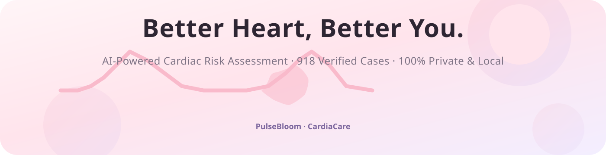

# 💓 PulseBloom · CardiaCare — Heart Disease Predictor

A serene, empathetic, premium **Streamlit** web app for cardiovascular risk
assessment and analytics, built on the design system in
[`uiprompt.md`](uiprompt.md). The interface is fully **claymorphism** — soft
squishy clay surfaces in light pink / light violet / soft creamy white — and a
**day ⇄ night theme toggle** (☀️/🌙) sits at the top-right corner of every page.
No cold hospital vibes.



---

## 📂 Project Structure

```text
HeartDisease_predictor/
├── assets/
│   ├── banner.svg                  # Large horizontal SVG banner for docs & hero
│   ├── style.css                   # Claymorphism design system (day tokens)
│   ├── theme_night.css             # Night-theme overrides (plum / glow clay)
│   └── illustrations/              # Standalone lightweight SVG vector assets
│       ├── hero_cardio.svg         # Sunrise silhouette scene (day)
│       ├── hero_cardio_night.svg   # Moonlit silhouette scene (night)
│       ├── ecg_heartbeat.svg       # Gentle pulse wave with heart emblem
│       ├── ecg_heartbeat_night.svg # Night pulse pill
│       ├── heart_shield.svg        # Preventive health & safety badge
│       ├── heart_shield_night.svg  # Night shield badge
│       ├── doctor_consult.svg      # Soft specialist doctor illustration
│       ├── doctor_consult_night.svg# Night doctor illustration
│       ├── empty_state.svg         # Gentle resting heart (model not trained)
│       ├── empty_state_night.svg   # Night empty state
│       ├── side_illustration.svg   # Sidebar clay heart on pedestal (day)
│       ├── side_illustration_night.svg # Sidebar illustration (night)
│       ├── icon_cardio.svg         # Heart rate & pulse category icon
│       ├── icon_vitals.svg         # Blood pressure & circulation icon
│       ├── icon_labs.svg           # Cholesterol & fasting blood sugar icon
│       ├── icon_ecg.svg            # Resting ECG & ST slope icon
│       └── icon_sparkle.svg        # Soft violet AI sparkle badge
├── models/
│   ├── heart_disease_model.pkl     # Trained Random Forest classifier
│   ├── scaler.pkl                  # Fitted StandardScaler
│   └── feature_metadata.json       # Feature order, one-hot maps & limits
├── pages/
│   ├── 1_💓_Predict.py             # Multi-parameter Heart Risk Evaluator
│   └── 2_📈_Dashboard.py           # Interactive Clinical Data Explorer
├── heart.csv                       # Cleveland/Hungarian/Swiss/VA dataset (918 records)
├── main.ipynb                      # EDA, benchmarking & model development
├── requirements.txt                # Python runtime dependencies
├── train_model.py                  # CLI training & artifact exporter
├── ui.py                           # Landing page entry point (hero & navigation)
├── utils.py                        # CSS loader, SVG encoder, model loaders
├── README.md                       # This documentation
└── uiprompt.md                     # UI/UX design specification & prompt
```

---

## 🚀 Quick Start

```bash
# 0. (Optional but recommended) create & activate a virtual environment
python -m venv venv
venv\Scripts\activate        # Windows PowerShell

# 1. Install dependencies
pip install -r requirements.txt

# 2. Train the model (replays main.ipynb's pipeline, writes models/)
python train_model.py

# 3. Launch the app
streamlit run ui.py
```

Open http://localhost:8501 — every page ships with a **clay sidebar** (vector
illustration brand + clay nav + dataset note) and a **clay topbar** whose
☀️/🌙 toggle at the top-right corner flips the whole UI (including charts and
all vector artwork) between day and night:

| Page | File | What it does |
| :--- | :--- | :--- |
| Landing | `ui.py` | Clay hero, vector artwork, ECG pill, category cards, doctor card |
| Risk Assessment | `pages/1_💓_Predict.py` | 11 clinical inputs → instant probability + wellness advice |
| Data Explorer | `pages/2_📈_Dashboard.py` | Plotly KPIs + filters + 4 charts in the clay palette |

---

## 🧠 Model

`train_model.py` replays `main.ipynb` **exactly**:

1. Zero-values in `Cholesterol` / `RestingBP` are imputed with the rounded
   non-zero mean (same as the notebook).
2. Categorical columns are one-hot encoded; `Sex_F` → `is_female`,
   `ExerciseAngina_Y` → `is_ExerciseAngina`; everything is cast to `int`.
3. `StandardScaler` is fit on `Age, RestingBP, Cholesterol, MaxHR, Oldpeak`
   over the full dataset.
4. Models from the notebook are benchmarked on the same 80/20 hold-out
   (`random_state=42`); the best by **F1-score** is exported.

Current benchmark (hold-out, `heart.csv`):

| Model | Accuracy | F1 |
| :--- | ---: | ---: |
| **Random Forest** | **0.8804** | **0.8942** |
| Logistic Regression | 0.8696 | 0.8846 |
| Support Vector Machine | 0.8587 | 0.8762 |
| KNN (n=5) | 0.8533 | 0.8683 |
| Naive Bayes | 0.8424 | 0.8571 |
| Decision Tree | 0.8261 | 0.8351 |

> ℹ️ The directory tree in `uiprompt.md` names the artifact `models/heart_disease_model.pkl`
> (incidentally spelled `hearter_disease_model.pkl` in one narrative sentence).
> This project saves `models/heart_disease_model.pkl` — the exact filename from the spec.

---

## 🎨 Design System (Claymorphism)

- **Palette (day):** Creamy white `#FAF8F5`, milk-rose clay `#FFF5F7`,
  light pink `#F9BACB`, light violet `#D9CEF7`, lilac tints `#FFF0F5` / `#F3EEFF`,
  deep plum ink `#2E2633`; mint `#D9F5E3` and coral `#FFE2E6` for status.
- **Palette (night):** Plum-black canvas `#1E1926 → #241D31`, clay panels
  `#2E2740 / #362C4A`, glowing pink `#EBA6C4`, glowing violet `#B9A1E8`,
  moon ink `#F4EFFA`; night mint `#72DFA6` and coral `#FF9DB4`.
- **Clay physics:** every card/button/input gets a raised outer shadow +
  inner emboss highlight; pressed states invert into an inset shadow.
- **Radii:** Cards `24px`, inputs `16px`, pills/buttons/toggles `9999px`,
  hero frame `42px`, sidebar illustration `26px`.
- **Type:** Plus Jakarta Sans (with system fallbacks); set in `assets/style.css`.
- **Theme switching:** `utils.apply_theme()` injects `style.css` plus
  `theme_night.css` when the session theme is `night`; `utils.svg_uri()`
  automatically serves the `_night.svg` variant of any illustration.

---

## 🔒 Privacy

All inference happens **locally** — trained on 918 verified clinical cases,
100% private. No health data leaves your machine. This tool is a **screening
aid, not a diagnosis**; consult a certified cardiologist for medical advice.